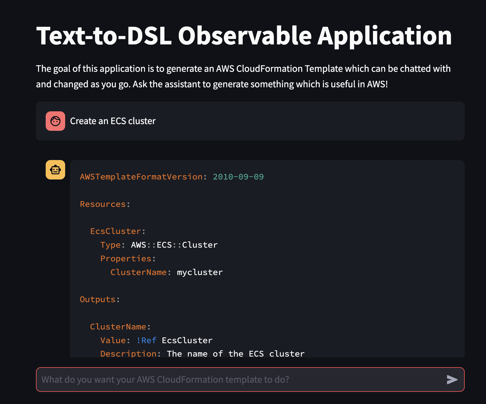
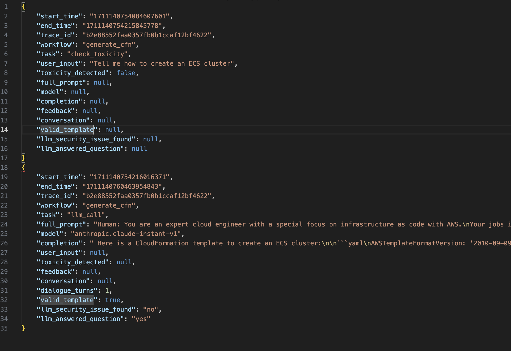

# Observing and Monitoring LLM Applications on AWS

## Introduction
In this repository, we'll outline and provide a sample framework for monitoring your Generative AI based applications on AWS. This includes how and what to monitor for your application, users, and LLM(s).

The use case we will be using throughout this repository is creating a simple conversational interface for generating [AWS CloudFormation](https://aws.amazon.com/cloudformation/) templates through natural language instructions.

**NOTE) The architecture in this repository is for development purposes only and will incur costs.**

## Walkthrough
For the demonstration in this repository, you will send your prompts from a [Streamlit](https://streamlit.io/), hosted on [Amazon Elastic Container Service (ECS)](https://aws.amazon.com/ecs/), front-end application to [Amazon Bedrock](https://aws.amazon.com/bedrock/). All prompts, responses, metrics and analysis will be stored in [Amazon Simple Storage Service (S3)](https://aws.amazon.com/s3/). The following is a detailed outline of the architecture in this repository:
1. A user logs in to the front-end application using an [Amazon Cognito](https://aws.amazon.com/cognito/) identity
2. User prompts are submitted from the front-end application to a large language model (LLM) on Amazon Bedrock. These prompt input and outputs are tracked using [OpenLLMetry](https://github.com/traceloop/openllmetry) which is an open source telemetry tool designed specifically for monitoring LLM applications
3. The LLM response is returned to the user and the conversational memory is preserved in the front-end application
4. Using the open source [OpenTelemetry collector container](https://opentelemetry.io/docs/collector/quick-start/), ECS exports OpenLLMetry traces to S3 and [Amazon CloudWatch](https://aws.amazon.com/pm/cloudwatch/)
5. These traces are then post-processed by an [Amazon Lambda function](https://aws.amazon.com/pm/lambda) which extracts relevant information from the trace JSON packets
6. The post-processed information is then sent to various APIs for evaluation of the model responses. In this example, we used LLMs to evaluate the outputs of the original LLM through Amazon Bedrock. See more about this LLM-as-a-judge pattern [here](https://huggingface.co/learn/cookbook/en/llm_judge). Furthermore, we also validate any CloudFormation templates created via the [ValidateTemplate API from CloudFormation](https://docs.aws.amazon.com/AWSCloudFormation/latest/APIReference/API_ValidateTemplate.html)
7. The results of this evaluation are then sent to [Amazon Data Firehose](https://aws.amazon.com/firehose/) to be written to Amazon S3 for consumption in downstream systems including, but not limited to, reporting stacks, analytics ecosystems, or LLM feedback mechanisms

The illustration below details what this solution will look like once fully implemented.


<br /> 

### Prerequisites
To follow through this repository, you will need an <a href="https://console.aws.amazon.com/" >AWS account</a>, an <a href="https://aws.amazon.com/about-aws/global-infrastructure/regional-product-services/" >Amazon Bedrock supported region</a>, permissions to create <a href="https://docs.aws.amazon.com/IAM/latest/UserGuide/id_roles.html" > AWS Identity and Access Management (IAM) roles and policies</a>, create <a href="https://docs.aws.amazon.com/lambda/latest/dg/getting-started.html#getting-started-create-function"> AWS Lambda Functions</a>, create <a href="https://docs.aws.amazon.com/AmazonECS/latest/developerguide/clusters-concepts.html"> Amazon ECS Cluster</a>, create <a href="https://docs.aws.amazon.com/AmazonECR/latest/userguide/repository-create.html"> Amazon Elastic Container Registry (ECR) </a>, create <a href="https://docs.aws.amazon.com/AmazonS3/latest/userguide/creating-bucket.html"> Amazon S3 buckets</a>, create <a href="https://docs.aws.amazon.com/firehose/latest/dev/basic-create.html"> Amazon Data Firehose streams</a>, access to [Amazon Bedrock](https://docs.aws.amazon.com/bedrock/latest/userguide/setting-up.html) and access to the <a href="https://aws.amazon.com/cli/">AWS CLI</a>. In addition, you will need an exiting hosted zone in [Amazon Route53](https://aws.amazon.com/route53/) and existing wildcard certificate in [AWS Certificate Manager (ACM)](https://aws.amazon.com/certificate-manager/). Finally, you will need [Docker](https://www.docker.com/), [Node.js](https://nodejs.org/en) and the [AWS Cloud Development Kit (CDK)](https://docs.aws.amazon.com/cdk/v2/guide/getting_started.html) installed locally. We also assume you have familiar with the basics of Linux bash commands.

### Step 1: Create the AWS CDK stack in your AWS account (AWS CDK)

1. Create two subdomains under your Amazon Route53 hosted zone. One will be for the Application Load Balancer and the other will be for the front-end application URL. For example, if your hosted zone is `foo.com`, you could pick:

    * `alb1.foo.com`
    * `app1.foo.com`
    
2. Run the AWS CDK commands below to deploy this application.
   1. <b>NOTE)</b> If this is your first time deploying this application, make sure you install all Node.js packages by running ```npm install``` below from the `cdk` folder

```
cdk bootstrap
cdk synth

//ensure you update all placeholder values in the command below
cdk deploy --all \
--stack-name ObserveLLMStack \
-c appCustomDomainName=<Enter Custom Domain Name to be used for Frontend App> \
-c appCustomDomainName2=<Enter Custom Domain Name to be used for Frontend App of second app> \
-c loadBalancerOriginCustomDomainName=<Enter Custom Domain Name to be used for Load Balancer Origin> \
-c loadBalancerOriginCustomDomainName2=<Enter Custom Domain Name to be used for Load Balancer Origin of second app> \
-c customDomainRoute53HostedZoneID=<Enter Route53 Hosted Zone ID for the Custom Domain being used> \
-c customDomainRoute53HostedZoneName=<Enter Route53 Hostedzone Name> \
-c customDomainCertificateArn=<Enter ACM Certificate ARN for Custom Domains provided>
```

### Step 2: Grant model access for Anthropic Claude Instant in Amazon Bedrock (AWS Console)
1. Ensure you have [granted model access](https://docs.aws.amazon.com/bedrock/latest/userguide/model-access.html#model-access-add) to the ```Anthropic Claude Instant``` model in Amazon Bedrock.

### Step 3: Create Amazon Cognito identity (AWS CLI)

1. Create a Amazon Cognito user in the user pool created in the last step.
```aws cognito-idp admin-create-user --user-pool-id <REPLACE_WITH_POOL_ID> --username <REPLACE_WITH_USERNAME> --temporary-password <REPLACE_WITH_TEMP_PASSWORD>```

### Step 4: Open the front-end application (Web browser)

1. Open the front-end application using the URL given in the CDK output `AppURL`. You will need to login with the Amazon Cognito identity created in step 2. You will be prompted to update the password.

### Step 5: Submit a prompt to create an AWS CloudFormation template (Web browser)
1. Submit a prompt such as ```Create an ECS cluster``` into the front-end application
2. From here, you should get a response similar to the image below.


### Step 6: Review completed analysis in Amazon S3 analysis bucket (AWS Console)
1. Navigate to your Amazon S3 bucket and open the folder ```otel-trace-analysis```
2. Navigate the folder structure using the latest year, month and day folders
3. Review the latest analysis file to see the prompts, responses, metrics and analysis collected. Your analysis file should look similar to the image below.


## Cleaning up
Be sure to remove the resources created in this repository to avoid charges. Run the following commands to delete these resources:
1. ```cdk destroy --all --stack-name ObserveLLMStack ```
2. ```aws admin-delete-user --user-pool-id <REPLACE_WITH_POOL_ID> --username <REPLACE_WITH_USERNAME>```

## Security

See [CONTRIBUTING](CONTRIBUTING.md#security-issue-notifications) for more information.

## License

This library is licensed under the MIT-0 License. See the LICENSE file.